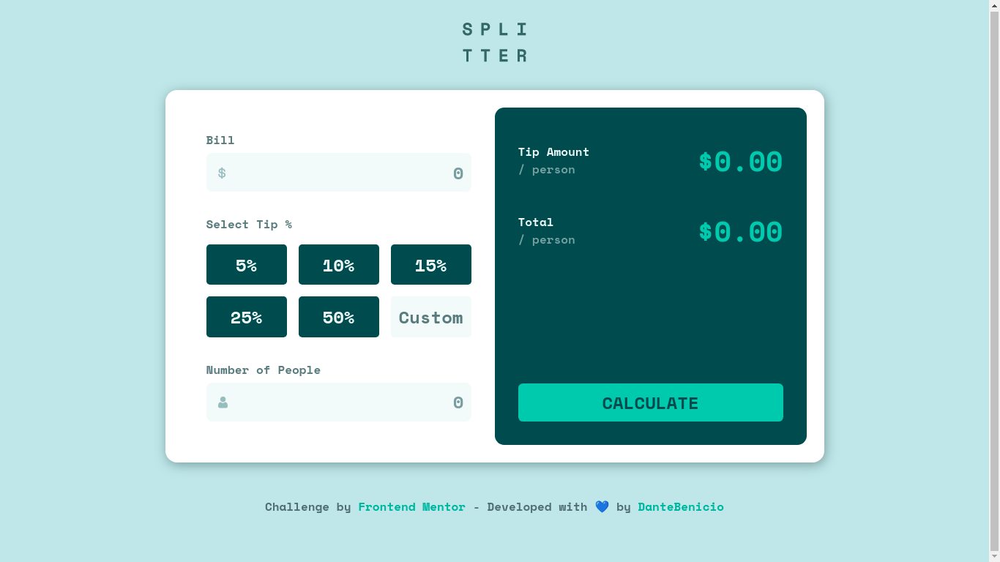
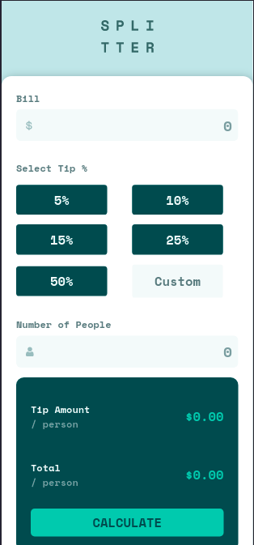

<div align="center">
  <h1>Tip Calculator</h1>
  

   [](https://tip-calculator-app-alpha-three.vercel.app/)

   
   
</div>


## ❔ About

This is a calculator tip app, where the person go to pay a value and add a percentage this payment value.

> Status: Production ✅

## 🚀 Run the project

```bash
# Clone the project from Github
git clone https://github.com/DanteBenicio/tip-calculator-app

# Access the project folder
cd tip-calculator-app

# Install the project dependencies
yarn
or
npm install

# Run the project (port 3000 - http://localhost:3000)
yarn dev
or
npm run dev
```

### About development
- This project was developed using Vite.js ⚡